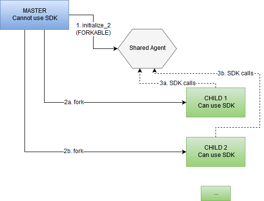
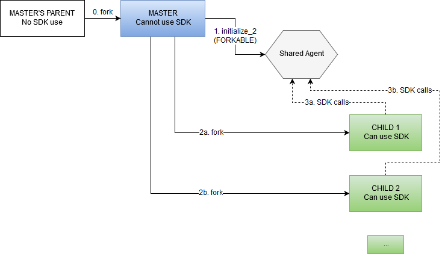
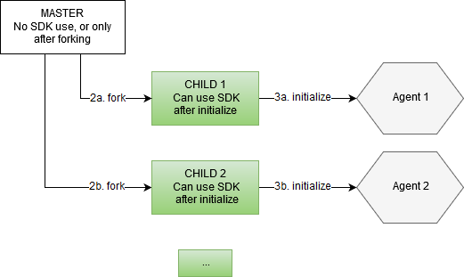
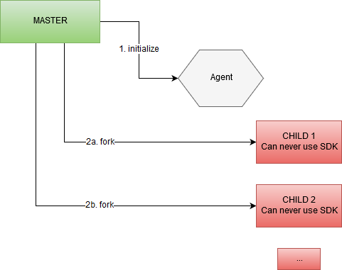

# Dynatrace OneAgent SDK for C/C++

This SDK enables Dynatrace customers to extend request level visibility into any native process. The SDK is C based and thus can be used in any C or C++ application. It can also be used in other languages via language bindings.
In order to use the development kit you need to have access to the source code of the application in question.

This is the official C/C++ implementation of the [Dynatrace OneAgent SDK](https://github.com/Dynatrace/OneAgent-SDK/).

<!-- Generate with https://github.com/jonschlinkert/markdown-toc -->

<!-- toc -->

- [Package contents](#package-contents)
- [Features](#features)
- [Documentation](#documentation)
- [Getting started](#getting-started)
  * [Getting the SDK](#getting-the-sdk)
  * [Building and linking against the Dynatrace OneAgent SDK](#building-and-linking-against-the-dynatrace-oneagent-sdk)
    + [Using CMake](#using-cmake)
    + [Auto-linking with Visual Studio](#auto-linking-with-visual-studio)
    + [Other build systems](#other-build-systems)
  * [Using CMake to build the samples](#using-cmake-to-build-the-samples)
  * [Initializing the Dynatrace OneAgent SDK](#initializing-the-dynatrace-oneagent-sdk)
    + [Special considerations for Solaris SPARC](#special-considerations-for-solaris-sparc)
- [How to instrument your application](#how-to-instrument-your-application)
  * [Trace remote calls](#trace-remote-calls)
  * [Trace SQL based database calls](#trace-sql-based-database-calls)
  * [Trace incoming web requests](#trace-incoming-web-requests)
  * [Trace outgoing web requests](#trace-outgoing-web-requests)
  * [Trace asynchronous activities](#trace-asynchronous-activities)
  * [Trace messaging](#trace-messaging)
  * [Trace custom service methods](#trace-custom-service-methods)
  * [Add custom request attributes](#add-custom-request-attributes)
  * [Report metrics (deprecated)](#metrics)
- [Using the Dynatrace OneAgent SDK with forked child processes (only available on Linux)](#using-the-dynatrace-oneagent-sdk-with-forked-child-processes-only-available-on-linux)
- [Troubleshooting](#troubleshooting)
- [Requirements](#requirements)
  * [Version support and compatibility table](#version-support-and-compatibility-table)
- [Help & Support](#help--support)
  * [Read the manual](#read-the-manual)
  * [Let us help you](#let-us-help-you)
- [Release Notes](#release-notes)

<!-- tocstop -->

<a name="package-contents"></a>

## Package contents

The SDK package includes
- `lib` and `include`: The libraries and header files necessary for instrumenting applications.
- `*.cmake`: Optional support files to use the libraries more easily with the CMake build system.
- `samples/sample1`: A simple sample application.
- `docs`: Reference documentation.

<a name="features"></a>

## Features

- [Trace any remote call end-to-end across processes and different programming languages.](#trace-remote-calls)
- [Trace any SQL-based database call.](#trace-sql-based-database-calls)
- [Trace incoming and outgoing web requests.](#trace-incoming-web-requests)
- [Trace asynchronous processing within one process.](#trace-outgoing-web-requests)
- [Trace messaging systems and messaging queues.](#trace-messaging)
- [Trace custom service methods.](#trace-custom-service-methods)
- [Add custom request attributes to any currently traced service.](#add-custom-request-attributes)

When tracing incoming or outgoing calls, requests or messages, this SDK is compatible with other OneAgent SDKs and OneAgent code modules in general.

See [Planned features for OneAgent
SDK](https://answers.dynatrace.com/spaces/483/dynatrace-product-ideas/idea/198106/planned-features-for-oneagent-sdk.html) for details on
upcoming features.

<a name="documentation"></a>

## Documentation

The reference documentation is included in this package. The most recent version is also available online at <https://dynatrace.github.io/OneAgent-SDK-for-C/>.

A high level documentation/description of OneAgent SDK concepts is available at <https://github.com/Dynatrace/OneAgent-SDK/>.

<a name="getting-started"></a>

## Getting started

<a name="getting-the-sdk"></a>

### Getting the SDK

To start using the Dynatrace OneAgent SDK for C/C++, simply download the latest source archive from [releases](https://github.com/Dynatrace/OneAgent-SDK-for-C/releases).
The source archive also includes all necessary artifacts (e.g. the static and dynamic library files), so this is all you need.
Extract the archive to a local folder on your machine and then add the appropriate "include" and "lib" paths to your build system.

To see if your platform is supported, refer to [requirements](#requirements).

<a name="building-and-linking-against-the-dynatrace-oneagent-sdk"></a>

### Building and linking against the Dynatrace OneAgent SDK

The SDK doesn't have to be compiled, you only need to link your application to the SDK libraries.

<a name="using-cmake"></a>

#### Using CMake

If you use CMake to generate build files for your application, you should be able to use the provided `onesdk-config.cmake` script ala

```CMake
include("path/to/sdk-package/onesdk-config.cmake")
target_link_libraries(your_application onesdk_static)
```

<a name="auto-linking-with-visual-studio"></a>

#### Auto-linking with Visual Studio

If you use Visual Studio to build a Windows application, you can use the SDK's auto-linking feature. To do this, simply define the preprocessor macro `ONESDK_AUTO_LINK` before including any SDK header file.
Aside from that, you only have to add the appropriate "include" and "lib" paths.

<a name="other-build-systems"></a>

#### Other build systems

If you use another build system you have to configure it to
- add an "include" path to `path/to/sdk-package/include`
- add a "lib" path to the appropriate platform subdirectory under `lib` (e.g. `path/to/sdk-package/lib/linux-x86_64`)
- link the appropriate library (e.g. `libonesdk_static.a`)

The SDK contains code that dynamically loads the agent library (`.dll`/`.so`/...), so depending on your platform you might need to link
additional libraries (e.g. under Linux you would typically add `-ldl` to the linker command line).

On Windows, when using Visual Studio 2015 or later, you also have to link `legacy_stdio_definitions.lib`.

<a name="using-cmake-to-build-the-samples"></a>

### Using CMake to build the samples

Assuming that you have a C++11 compiler and suitable build system installed (e.g. Visual Studio or g++ & make), which are supported and correctly detected by CMake, creating build files for the samples can be as easy as

```
C:\onesdk\samples>mkdir build
C:\onesdk\samples>cd build
C:\onesdk\samples\build>cmake ..
  *snip* a lot of CMake output
-- Build files have been written to: C:/onesdk/samples/build
C:\onesdk\samples\build>
```

Then simply use your build system to build the samples (e.g. "make" or open & build the generated solution in Visual Studio).

<a name="initializing-the-dynatrace-oneagent-sdk"></a>

### Initializing the Dynatrace OneAgent SDK

To initialize the OneAgent SDK, you call [`onesdk_initialize`][refd_initialize], like in the following sample. It is higly recommended that
you call [`onesdk_shutdown`][refd_shutdown] when the application is done using the SDK (typically just before exiting):

```C
#include <onesdk/onesdk.h>
#include <stdio.h>

static void mycallback(char const* message) {
    fputs(message, stderr);
}

int main(int argc, char** argv) {
    onesdk_stub_process_cmdline_args(argc, argv, 1);  /* optional: let the SDK process command line arguments   */
    onesdk_stub_strip_sdk_cmdline_args(&argc, argv);  /* optional: remove SDK command line arguments from argv  */

    /* Initialize SDK */
    onesdk_result_t const onesdk_init_result = onesdk_initialize();

    /* optional: Set logging callbacks. */
    onesdk_agent_set_warning_callback(mycallback); /* Highly recommended. */
    onesdk_agent_set_verbose_callback(mycallback); /* Recommended for development & debugging. */

    /* ... use SDK ... */

    /* Shut down SDK */
    if (onesdk_init_result == ONESDK_SUCCESS)
        onesdk_shutdown();

    return 0;
}
```

> 📕 [Reference documentation for initialization and shutdown](https://dynatrace.github.io/OneAgent-SDK-for-C/group__init.html)  
> 📕 [Miscellaneous functions](https://dynatrace.github.io/OneAgent-SDK-for-C/group__misc.html)

<a name="special-considerations-for-solaris-sparc"></a>

#### Special considerations for Solaris SPARC

For agents older than 1.173, auto-configuration is not supported for the OneAgent SDK for C/C++ on Solaris SPARC. Thus you must either use
[`onesdk_stub_set_variable`][refd_set_variable] before calling [`initialize`][refd_initialize], or set certain environment variables. If you
use [`onesdk_stub_process_cmdline_args`][refd_process_cmdline_args], you can also use command line options. If you are familiar with [manual
injection for Apache or Java on
Solaris](https://www.dynatrace.com/support/help/setup-and-configuration/oneagent/solaris/installation/install-oneagent-on-solaris/#expand-464manual-oneagent-injection),
this may sound familiar to you.

The following options must be set (to specify on the command line, use the `set_variable`-name but prepend `--dt_`):

|`set_variable`|Environment variable |Value                                                                                      |
|:-------------|:--------------------|:------------------------------------------------------------------------------------------|
|`home`        |`DT_HOME`            |Your Dynatrace OneAgent installation folder, e.g. `/opt/dynatrace/oneagent/`.              |
|`tenant`      |`DT_TENANT`          |The environment ID of your Dynatrace environment.                                          |
|`tenantToken` |`DT_TENANTTOKEN`     |The token that OneAgent uses to connect to Dynatrace Server. **Not** an API or PaaS token! |
|`server`      |`DT_CONNECTION_POINT`|One or multiple HTTP addresses that represent Dynatrace Servers or ActiveGates.            |

Please obtain the values of all these variables (except for `home` / `DT_HOME`) from `$DT_HOME/dynatrace-env.sh`. You can also use this
script directly to set the environment variables (except `DT_HOME`), or start your SDK-using application with
`$DT_HOME/dynatrace-agent<bitness>.sh <executable> <other command line arguments>` (but you still need to set `home` / `DT_HOME`).

For example, to set `home` via [`onesdk_stub_set_variable`][refd_set_variable], do something like
`onesdk_stub_set_variable(ONESDK_XSTR("home=/opt/dynatrace/oneagent"), 0);` in your code OR set the `DT_HOME` environment variable, OR, if
your application calls [`onesdk_stub_process_cmdline_args`][refd_process_cmdline_args], you can pass `--dt_home=/opt/dynatrace/oneagent` on
the command line.

There is an additional option you may want to set: `loglevelcon` / `DT_LOGLEVELCON` can be set to `none` to stop the agent from writing to
stderr (see also [Troubleshooting](#troubleshooting)).

[refd_initialize]: https://dynatrace.github.io/OneAgent-SDK-for-C/group__init.html#gac3d473d2899bdb54196f864ae0ccf3eb
[refd_shutdown]: https://dynatrace.github.io/OneAgent-SDK-for-C/group__init.html#gab65ee07ae9c61fae6d0ca0b4afbd8bb1
[refd_set_variable]: https://dynatrace.github.io/OneAgent-SDK-for-C/group__init.html#ga1271327bb21c71ed5f8d92de0629ebfc
[refd_process_cmdline_args]: https://dynatrace.github.io/OneAgent-SDK-for-C/group__init.html#ga77bf723c281e4e2963933a57ff1ec51c

<a name="using-the-dynatrace-oneagent-sdk-to-trace-remote-calls"></a>

<a name="how-to-instrument-your-application"></a>

## How to instrument your application

This section gives samples of how to instrument your application for each supported feature. Refer to the [documentation](#documentation)
for more details.

> See also:
>
> 📕 [Reference documentation for common tracer functions](https://dynatrace.github.io/OneAgent-SDK-for-C/group__tracers.html)

<a name="trace-remote-calls"></a>

### Trace remote calls

You can use the SDK to trace proprietary IPC communication from one process to the other. This will enable you to see full Service Flow,
PurePath and Smartscape topology for remoting technologies that Dynatrace is not aware of.

Instrumenting an outgoing remote call:

```C
    /* create tracer */
    onesdk_tracer_handle_t const tracer = onesdk_outgoingremotecalltracer_create(
        onesdk_asciistr("remote service method"),
        onesdk_asciistr("logical service name"),
        onesdk_asciistr("deployed service endpoint"),
        ONESDK_CHANNEL_TYPE_TCP_IP,           /* channel type     */
        onesdk_asciistr("localhost:12345")    /* channel endpoint, host/ip:port in case of TCP_IP */ );

    /* start tracer */
    onesdk_tracer_start(tracer);

    /* get byte representation of tag */
    onesdk_size_t byte_tag_size = 0;
    onesdk_tracer_get_outgoing_dynatrace_byte_tag(tracer, NULL, 0, &byte_tag_size);
    unsigned char* byte_tag = NULL;
    if (byte_tag_size != 0) {
        byte_tag = (unsigned char*)malloc(byte_tag_size);
        if (byte_tag != NULL)
            byte_tag_size = onesdk_tracer_get_outgoing_dynatrace_byte_tag(tracer, byte_tag, byte_tag_size, NULL);
    }

    /* ... do the actual remote call (send along `byte_tag` so the other side can continue tracing) ... */

    /* release tag memory */
    free(byte_tag);

    /* set error information */
    if (something_went_wrong)
        onesdk_tracer_error(tracer, onesdk_asciistr("error type"), onesdk_asciistr("error message"));

    /* end and release tracer */
    onesdk_tracer_end(tracer);
```

Instrumenting an incoming remote call:

```C
    unsigned char const* byte_tag = ...;    /* pointer to the byte tag that we received from the caller */
    onesdk_size_t byte_tag_size = ...;      /* size of the byte tag that we received from the caller    */

    /* create tracer */
    onesdk_tracer_handle_t const tracer = onesdk_incomingremotecalltracer_create(
        onesdk_asciistr("remote service method"),
        onesdk_asciistr("logical service name"),
        onesdk_asciistr("deployed service endpoint"));

    /* set the tag that we got from the caller */
    if (byte_tag_size != 0)
        onesdk_tracer_set_incoming_dynatrace_byte_tag(tracer, byte_tag, byte_tag_size);

    /* start tracer */
    onesdk_tracer_start(tracer);

    /* ... do the actual work ... */

    /* set error information */
    if (something_went_wrong)
        onesdk_tracer_error(tracer, onesdk_asciistr("error type"), onesdk_asciistr("error message"));

    /* end & release tracer */
    onesdk_tracer_end(tracer);
```

> 📕 [Reference documentation for remote call tracers](https://dynatrace.github.io/OneAgent-SDK-for-C/group__remote__calls.html)

<a name="using-the-dynatrace-oneagent-sdk-to-trace-sql-based-database-calls"></a>
<a name="trace-sql-based-database-calls"></a>

### Trace SQL based database calls

To trace database requests you need a database info object which stores the information about your database which does not change between
individual requests. This will typically be created somewhere in your initialization code (after initializing the SDK):

```C
onesdk_databaseinfo_handle_t db_info_handle = ONESDK_INVALID_HANDLE;

/* ... */

    db_info_handle = onesdk_databaseinfo_create(
        onesdk_asciistr("database name"),   /* the name of the database that you connect to */
        onesdk_asciistr(ONESDK_DATABASE_VENDOR_POSTGRESQL),   /* the type of the database   */
        ONESDK_CHANNEL_TYPE_TCP_IP,         /* channel type     */
        onesdk_asciistr("localhost:12345")  /* channel endpoint */ );
```

Then you can trace the SQL database requests:

```C
    /* create tracer */
    onesdk_tracer_handle_t const tracer = onesdk_databaserequesttracer_create_sql(
        db_info_handle,
        onesdk_asciistr("SELECT foo FROM bar;"));

    /* start tracer */
    onesdk_tracer_start(tracer);

    /* ... perform the database request, consume results ... */

    /* optional: set number of returned rows */
    onesdk_databaserequesttracer_set_returned_row_count(tracer, 42);
    /* optional: set number of round trips between client and database */
    onesdk_databaserequesttracer_set_round_trip_count(tracer, 3);

    /* set error information */
    if (something_went_wrong)
        onesdk_tracer_error(tracer, onesdk_asciistr("error type"), onesdk_asciistr("error message"));

    /* end & release tracer */
    onesdk_tracer_end(tracer);
```

Finally, release the database info object in your cleanup code (before shutting down the SDK):

```C
    onesdk_databaseinfo_delete(db_info_handle);
    db_info_handle = ONESDK_INVALID_HANDLE;
```

Please note that SQL database traces are only created if they occur within some other SDK trace (e.g. incoming remote call).

> 📕 [Reference documentation for database request tracers](https://dynatrace.github.io/OneAgent-SDK-for-C/group__database__requests.html)

<a name="using-the-dynatrace-oneagent-sdk-to-trace-incoming-web-requests"></a>
<a name="trace-incoming-web-requests"></a>

### Trace incoming web requests

To trace incoming web requests you first need to create a web application info object which describes your web application:

```C
onesdk_webapplicationinfo_handle_t web_application_info_handle = ONESDK_INVALID_HANDLE;

/* ... */

    web_application_info_handle = onesdk_webapplicationinfo_create(
        onesdk_asciistr("example.com"),         /* name of the web server that hosts your application */
        onesdk_asciistr("MyWebApplication"),    /* unique name for your web application               */
        onesdk_asciistr("/my-web-app/")         /* context root of your web application               */ );
```

Then you can trace incoming web requests:

```C
    /* create tracer */
    onesdk_tracer_handle_t const tracer = onesdk_incomingwebrequesttracer_create(
        web_application_info_handle,
        onesdk_asciistr("/my-web-app/content.html?q1=1&q2=2#frag"),
        onesdk_asciistr("GET"));

    /* add information about the incoming request */
    onesdk_incomingwebrequesttracer_set_remote_address(tracer, onesdk_asciistr("1.2.3.4:56789"));
    onesdk_incomingwebrequesttracer_add_request_header(tracer,
        onesdk_asciistr("Connection"), onesdk_asciistr("keep-alive"));
    onesdk_incomingwebrequesttracer_add_request_header(tracer,
        onesdk_asciistr("Pragma"), onesdk_asciistr("no-cache"));
    /* ... */

    /* start tracer */
    onesdk_tracer_start(tracer);

    /* ... service the web request ... */

    /* add information about the response */
    onesdk_incomingwebrequesttracer_add_response_header(tracer,
        onesdk_asciistr("Transfer-Encoding"), onesdk_asciistr("chunked"));
    onesdk_incomingwebrequesttracer_add_response_header(tracer,
        onesdk_asciistr("Content-Length"), onesdk_asciistr("1234"));
    onesdk_incomingwebrequesttracer_set_status_code(tracer, 200);
    /* ... */

    /* set error information */
    if (something_went_wrong)
        onesdk_tracer_error(tracer, onesdk_asciistr("error type"), onesdk_asciistr("error message"));

    /* end & release tracer */
    onesdk_tracer_end(tracer);
```

And release the web application info object before shutting down the SDK:

```C
    onesdk_webapplicationinfo_delete(web_application_info_handle);
    web_application_info_handle = ONESDK_INVALID_HANDLE;
```

> 📕 [Reference documentation for incoming web request tracers](https://dynatrace.github.io/OneAgent-SDK-for-C/group__incoming__web__requests.html)
>
> ➡️ [Trace outgoing web requests](#trace-outgoing-web-requests)

<a name="using-the-dynatrace-oneagent-sdk-to-trace-outgoing-web-requests"></a>
<a name="trace-outgoing-web-requests"></a>

### Trace outgoing web requests

You can use the SDK to trace web requests sent by your application:

```C
    /* create tracer */
    onesdk_tracer_handle_t const tracer = onesdk_outgoingwebrequesttracer_create(
        onesdk_asciistr("http://example.org:1234/my/rest-service/resources?filter=foo"),
        onesdk_asciistr("GET"));

    /* add information about the request we're about to send */
    onesdk_outgoingwebrequesttracer_add_request_header(tracer,
        onesdk_asciistr("Accept-Charset"), onesdk_asciistr("utf-8"));
    onesdk_outgoingwebrequesttracer_add_request_header(tracer,
        onesdk_asciistr("Pragma"), onesdk_asciistr("no-cache"));
    /* ... */

    /* start tracer */
    onesdk_tracer_start(tracer);

    /* get string representation of tag */
    onesdk_size_t string_tag_size = 0;
    onesdk_tracer_get_outgoing_dynatrace_string_tag(tracer, NULL, 0, &string_tag_size);
    char* string_tag = NULL;
    if (string_tag_size != 0) {
        string_tag = (char*)malloc(string_tag_size);
        if (string_tag != NULL)
            string_tag_size = onesdk_tracer_get_outgoing_dynatrace_string_tag(tracer, string_tag, string_tag_size, NULL);
    }

    /* ... actually send the HTTP request, sending along `string_tag` as an HTTP header
           (use the macro `ONESDK_DYNATRACE_HTTP_HEADER_NAME` for the header name),
           receive the reply and decode it ... */

    /* release tag memory */
    free(string_tag);

    /* add information about the response */
    onesdk_outgoingwebrequesttracer_add_response_header(tracer,
        onesdk_asciistr("Transfer-Encoding"), onesdk_asciistr("chunked"));
    onesdk_outgoingwebrequesttracer_add_response_header(tracer,
        onesdk_asciistr("Content-Length"), onesdk_asciistr("1234"));
    onesdk_outgoingwebrequesttracer_set_status_code(tracer, 200);
    /* ... */

    /* set error information */
    if (something_went_wrong)
        onesdk_tracer_error(tracer, onesdk_asciistr("error type"), onesdk_asciistr("error message"));

    /* end and release tracer */
    onesdk_tracer_end(tracer);
```

> 📕 [Reference documentation for outgoing web request tracers](https://dynatrace.github.io/OneAgent-SDK-for-C/group__outgoing__web__requests.html)
>
> ➡️ [Trace incoming web requests](#trace-incoming-web-requests)

<a name="using-the-dynatrace-oneagent-sdk-to-trace-asynchronous-activities"></a>
<a name="trace-asynchronous-activities"></a>

### Trace asynchronous activities

Many applications schedule work in some asynchronous fashion. Automatic linking of tracers will not work in such scenarios - it can only link to the innermost active tracer on the current thread.
To link the asynchronous parts to the currently active tracer, you first have to create an in-process link:

```C
    /* create in-process link */
    onesdk_size_t in_process_link_size = 0;
    onesdk_inprocesslink_create(NULL, 0, &in_process_link_size);
    unsigned char* in_process_link = NULL;
    if (in_process_link_size != 0) {
        in_process_link = (unsigned char*)malloc(in_process_link_size);
        if (in_process_link != NULL)
            in_process_link_size = onesdk_inprocesslink_create(in_process_link, in_process_link_size, NULL);
    }

    /* ... start/queue asynchronous work (send along `in_process_link` so the other side can continue tracing) ... */

    /* release in-process link memory */
    free(in_process_link);
```

Once you have the in-process link, you can create an in-process link tracer to continue tracing in another thread:

```C
    unsigned char const* in_process_link = ...;  /* pointer to the in-process link */
    onesdk_size_t in_process_link_size = ...;    /* size of the in-process link    */

    /* create in-process link tracer */
    onesdk_tracer_handle_t const tracer = onesdk_inprocesslinktracer_create(
        in_process_link,
        in_process_link_size);

    /* start tracer ("activates" the in-process link) */
    onesdk_tracer_start(tracer);

    /* ... do the work - new tracers started here will be linked to wherever the in-process link was created ... */

    /* end & release tracer ("deactivates" the in-process link) */
    onesdk_tracer_end(tracer);
```

Note that you can re-use in-process links to create multiple in-process link tracers.

> 📕 [Reference documentation for in-process link functions](https://dynatrace.github.io/OneAgent-SDK-for-C/group__in__process__links.html)

<a name="using-the-dynatrace-oneagent-sdk-to-trace-messaging"></a>
<a name="trace-messaging"></a>

### Trace messaging

To trace interaction with a messaging system, such as sending and receiving messages from message queues, you need a messaging system info
object which stores the information about your messaging system that does not change between individual requests. This will typically be
created somewhere in your initialization code (after initializing the SDK):

```C
    onesdk_messagingsysteminfo_handle_t messagingsysteminfo_handle = onesdk_messagingsysteminfo_create(
        onesdk_asciistr(ONESDK_MESSAGING_VENDOR_RABBIT_MQ), // vendor name
        onesdk_asciistr("myqueue"),                         // destination name
        ONESDK_MESSAGING_DESTINATION_TYPE_QUEUE,            // destination type
        ONESDK_CHANNEL_TYPE_TCP_IP,                         // channel type
        onesdk_asciistr("example.com:1234"));               // channel endpoint
```

Then you can trace sending, receiving and processing of messages.

Tracing the sending of messages is straightforward and works like other tracers:

```C
    /* create tracer */
    onesdk_tracer_handle_t const tracer = onesdk_outgoingmessagetracer_create(messagingsysteminfo_handle);

    /* start tracer */
    onesdk_tracer_start(tracer);

    /* get byte representation of tag (an ASCII string representation is also supported) */
    onesdk_size_t byte_tag_size = 0;
    onesdk_tracer_get_outgoing_dynatrace_byte_tag(tracer, NULL, 0, &byte_tag_size);
    unsigned char* byte_tag = NULL;
    if (byte_tag_size != 0) {
        byte_tag = (unsigned char*)malloc(byte_tag_size);
        if (byte_tag != NULL)
            byte_tag_size = onesdk_tracer_get_outgoing_dynatrace_byte_tag(tracer, byte_tag, byte_tag_size, NULL);
    }

    /* ... do the actual message sending (send along `byte_tag` so the other side can continue tracing) ... */
    mymessage_add_header(mymessage, ONESDK_DYNATRACE_MESSAGE_PROPERTY_NAME, byte_tag, byte_tag_size);
    mymessage_send(mymessage);

    /* release tag memory */
    free(byte_tag);

    /* optional: set message ID, if provided by the messaging system */
    onesdk_outgoingmessagetracer_set_vendor_message_id(tracer, onesdk_asciistr(mymessage_get_id_str(mymessage)));

    /* optional: set correlation ID, if you have one (usually application-defined) */
    onesdk_outgoingmessagetracer_set_correlation_id(tracer, onesdk_asciistr(mycorrelationid);

    /* set error information */
    if (something_went_wrong)
        onesdk_tracer_error(tracer, onesdk_asciistr("error type"), onesdk_asciistr("error message"));

    /* end and release tracer */
    onesdk_tracer_end(tracer);
```

For the other side, we distinguish two activities: Receiving the message an processing it. You can (optionally) use a tracer around
receiving one or multiple messages if you are interested in the time the actual receiving takes. For the processing of the message, i.e.,
any business logic that is executed in response to the message content, there is a different tracer. Note that only the tracer for
processing messages supports an incoming tag. This is because the incoming tag must be set before starting the tracer and this cannot be
done for the receive-tracer, as the tag is normally part of the message content or headers, thus available only after message receipt.

The following example shows using the message receive and process tracers in the recommended combination, i.e., starting the process tracer
inside the receive tracer:

```C
    onesdk_tracer_handle_t receive_tracer = onesdk_incomingmessagereceivetracer_create(messagingsysteminfo_handle);

    /* start receive_tracer */
    onesdk_tracer_start(receive_tracer);

    while (/* ... e.g., a message is available in the queue, or only once ... */) {
        /* ... actually receive a message, ... */

        unsigned char const* byte_tag = mymessage_get_header_optional(mymessage, ONESDK_DYNATRACE_MESSAGE_PROPERTY_NAME);
        onesdk_size_t byte_tag_size = ...;      /* size of the byte tag that we received (Note: byte_tag is not null-terminated) */

        /* create process_tracer */
        onesdk_tracer_handle_t const process_tracer = onesdk_incomingmessageprocesstracer_create(messagingsysteminfo_handle);

        /* set the tag that we got from the message */
        if (byte_tag_size != 0)
            onesdk_tracer_set_incoming_dynatrace_byte_tag(process_tracer, byte_tag, byte_tag_size);

        /* optional: set message ID, if provided by the messaging system */
        onesdk_outgoingmessagetracer_set_vendor_message_id(process_tracer, onesdk_asciistr(mymessage_get_id_str(mymessage)));

        /* optional: set correlation ID, if you have one (usually application-defined) */
        onesdk_outgoingmessagetracer_set_correlation_id(process_tracer, onesdk_asciistr(mycorrelationid));

        /* start process_tracer */
        onesdk_tracer_start(process_tracer);

        /* ... do the actual work: process the message content, do something in response, ... */

        /* set error information */
        if (something_went_wrong_with_processing)
            onesdk_tracer_error(process_tracer, onesdk_asciistr("error type"), onesdk_asciistr("error message"));

        /* end & release process_tracer */
        onesdk_tracer_end(process_tracer);
    }
    /* set error information */
    if (something_went_wrong_with_receiving)
        onesdk_tracer_error(receive_tracer, onesdk_asciistr("error type"), onesdk_asciistr("error message"));
    onesdk_tracer_end(receive_tracer);
```

Note that currently, the receive tracer will never create a new PurePath, so if it is not started inside another started tracer, nothing
will be traced by it (although the message process tracer will still work).


You should not forget to release the messaging system info object in your cleanup code (before shutting down the SDK):

```C
    onesdk_messagingsysteminfo_delete(messagingsysteminfo_handle);
    messagingsysteminfo_handle = ONESDK_INVALID_HANDLE;
```

> 📕 [Reference documentation for messaging tracers](https://dynatrace.github.io/OneAgent-SDK-for-C/group__messaging.html)  
> 📗 [Documentation on messaging tracers in the specification repository](https://github.com/Dynatrace/OneAgent-SDK#messaging)

<a name="using-the-dynatrace-oneagent-sdk-to-trace-custom-service-methods"></a>
<a name="trace-custom-service-methods"></a>

### Trace custom service methods

You can use the SDK to trace custom service methods. A custom service method is a meaningful part of your code that you want to trace but
that does not fit any other tracer.

```C
    /* create tracer */
    onesdk_tracer_handle_t const tracer = onesdk_customservicetracer_create(
        onesdk_asciistr("custom service method"),
        onesdk_asciistr("logical service name"));

    /* start tracer */
    onesdk_tracer_start(tracer);

    /* ... actually execute the custom service ... */

    /* set error information */
    if (something_went_wrong)
        onesdk_tracer_error(tracer, onesdk_asciistr("error type"), onesdk_asciistr("error message"));

    /* end and release tracer */
    onesdk_tracer_end(tracer);
```

> 📕 [Reference documentation for custom service tracers](https://dynatrace.github.io/OneAgent-SDK-for-C/group__customservice.html)

<a name="using-the-dynatrace-oneagent-sdk-to-add-custom-request-attributes"></a>
<a name="add-custom-request-attributes"></a>

### Add custom request attributes

You can add custom request attributes (key value pairs) to the currently traced service. Those attributes can then be used to e.g. search/filter requests in Dynatrace.
To add a custom request attribute, simply call one of the `onesdk_customrequestattribute_add_{type}` functions:

```C
    /* add simple values */
    onesdk_customrequestattribute_add_integer(onesdk_asciistr("account-id"), 42);
    onesdk_customrequestattribute_add_float(onesdk_asciistr("service-quality"), 0.707106);
    onesdk_customrequestattribute_add_string(onesdk_asciistr("region"), onesdk_asciistr("emea"));

    /* add multiple values with the same key to create a list */
    onesdk_customrequestattribute_add_integer(onesdk_asciistr("account-group"), 1);
    onesdk_customrequestattribute_add_integer(onesdk_asciistr("account-group"), 2);
    onesdk_customrequestattribute_add_integer(onesdk_asciistr("account-group"), 3);
```

This will add the custom request attributes to the currently traced service. If no tracer is active, the values will be discarded.

> 📕 [Reference documentation for custom request attributes](https://dynatrace.github.io/OneAgent-SDK-for-C/group__custom__request__attributes.html)


<a name="metrics"></a>
<a name="report-metrics"></a>
<a name="report-metrics-preview-feature"></a>

### Report metrics (deprecated)

> **Note**: The metrics API was part of a
> [Dynatrace preview program](https://www.dynatrace.com/support/help/whats-new/preview-and-early-adopter-releases/)
> that has been **discontinued**. All metrics-related APIs have been **deprecated** and will be removed in a future release.
> The [Metric ingestion page][mint] provides further information on how to replace these APIs and how to report
> metrics data from now on.

You can report metrics (i.e., time series data) using the OneAgent SDK. Counters, gauges and statistic metrics for floating point and integer numbers with one or zero additional dimensions are supported. Make sure to read the [reference documentation][metricref] to find out which metric is right for your use case. To give you an example of an integer gauge with one additional dimensions:

```C
    /* Create a metric handle somewhere in your initialization logic (after initializing the SDK) */
    onesdk_metric_handle_t const mqsize_metric = onesdk_integergaugemetric_create(
        /*key=*/ onesdk_asciistr("message_queue.size"),
        /*unit=*/ onesdk_asciistr("count"),
        /*dimension_name=*/onesdk_asciistr("queue_name"));

    /* Periodically update the gauge with the current value (use a statistic instead, if you update event-based) */
    onesdk_integergaugemetric_set_value(mqsize_metric, get_my_queue_size(), onesdk_asciistr("myqueuename"));

    /* Somewhere before shutting down the SDK: */
    onesdk_metric_delete(mqsize_metric);
```

In general, you should try to use the same metric handle for the same metric instead of creating a new handle each time you report a value.

You will need to subscribe to the metric in Dynatrace to see it. If a metric is not subscribed the agent will efficiently discard it.

Note that metrics will currently not work when the SDK is initialized in [forkable mode](#forking).

> 📕 [Reference documentation for metrics][metricref]  
> ➡️ [Dynatrace Help on preview features][previewhelp]  
> ➡️ [Dynatrace Metric ingestion][mint]

[metricref]: https://dynatrace.github.io/OneAgent-SDK-for-C/group__ex__metrics.html
[previewhelp]: https://www.dynatrace.com/support/help/shortlink/preview-and-early-adopter-releases
[mint]: https://www.dynatrace.com/support/help/how-to-use-dynatrace/metrics/metric-ingestion/

<a name="forking"></a>
<a name="using-the-dynatrace-oneagent-sdk-with-forked-child-processes-only-available-on-linux"></a>
<a name="using-the-dynatrace-oneagent-sdk-with-forked-child-processes-not-available-on-windows"></a>

## Using the Dynatrace OneAgent SDK with forked child processes (only available on Linux)

Some applications, especially web servers, use a concurrency model that is based on forked child processes. Typically a master process
is started which is responsible only for creating and managing child processes by means of forking. The child processes do the real work,
for example handling web requests.

The recommended way to use the SDK in such a scenario is as follows: You initialize the SDK in the master using the [`onesdk_initialize_2`
function][refd_initialize_2] passing the [`ONESDK_INIT_FLAG_FORKABLE` flag][refd_init_flag_forkable] in the flags argument. This way you
will not be able to use the SDK in the master process (attempts to do so will be ignored, if applicable with an error code), but all forked
child processes will share the same agent. This has a lower overhead, for example the startup of worker processes is not slowed down, and
the per-worker memory overhead is reduced.


Recommended, simple scenario:



Double/daemon forks (i.e., a process forks a single child and then terminates) are also supported, as long as the intermediate child does
not use the SDK. If possible, it is better to initialize the SDK only in the intermediate child, as illustrated in the diagram below, but
calling `onesdk_initialize_2(ONESDK_FORKABLE)` in the master's parent process is also supported (take especial care to not use any SDK
functions in the master then, not even `onesdk_agent_get_current_state`).



There are some scenarios where you may not be able to use this feature:

* You have to use an older SDK or agent version which does not support the `onesdk_initialize_2` API, or
* You have no control over the master process, i.e. are unable to ensure that `onesdk_initialize_2` is called before the first fork in the
  master process.

In these cases, you can use the following workaround: Instead of initializing the SDK in the master process, you initialize it
(without the `ONESDK_INIT_FLAG_FORKABLE` flag) in each worker process. This has the consequence that each process is monitored
separately with its own agent. This is not recommended as each per-worker agent will have to establish and maintain its own
connection to Dynatrace, which results in higher overhead, especially at startup.

  

When you initialize the SDK using `onesdk_initialize` or without passing `ONESDK_INIT_FLAG_FORKABLE` to `onesdk_initialize_2`,
you may not use the SDK in forked child processes (attempts to do so will simply do nothing and may return the `ONESDK_ERROR_FORK_CHILD`
error code).



Example for SDK initialization with `ONESDK_INIT_FLAG_FORKABLE`:

```C
#include <stdio.h>
#include <string.h>
#include <unistd.h>

#include <onesdk/onesdk.h>

onesdk_result_t g_onesdk_init_result = ONESDK_ERROR_NOT_INITIALIZED;

int worker_main();

int main(int argc, char** argv) {
    onesdk_stub_process_cmdline_args(argc, argv, 1);  /* optional: let the SDK process command line arguments   */
    onesdk_stub_strip_sdk_cmdline_args(&argc, argv);  /* optional: remove SDK command line arguments from argv  */

    /* Initialize SDK in forkable mode. */
    g_onesdk_init_result = onesdk_initialize_2(ONESDK_INIT_FLAG_FORKABLE);
    /* Assuming everything went well, the SDK is now in a _parent-initialized_ state. That means child processes
       that this process forks will be able to use the SDK with very little initialization overhead.
       (This process, the master, won't be able to use the SDK though.) */

    /* This process can now proceed and fork some workers, either all at once or on demand ... */

    static size_t const worker_count = 10;
    for (size_t i = 0; i < worker_count; ++i) {
        int const worker_pid = fork();
        if (worker_pid == -1) {
            perror("fork(2) failed");
            return 1;
        } else if (worker_pid == 0) {
            return worker_main();
        } else {
            /* ... remember worker PID/establish communication ... */
        }
    }

    /* ... maybe accept connections, dispatch work to the worker processes, wait(2) for them ... */

    /* ... unitl eventualls it's time to shut down. */

    /* Shut down SDK */
    if (g_onesdk_init_result == ONESDK_SUCCESS)
        onesdk_shutdown();

    return 0;
}

int worker_main() {
    /* Assuming everything went well in the parent process and `g_onesdk_init_result == ONESDK_SUCCESS`,
       this process has inherited the SDK in a _pre-initialized_ state.
       (The initialization state changes from _parent-initialized_ to _pre-initialized_ while forking.)
       That means the SDK initialization will automatically be completed when this process begins to use
       the SDK, e.g. when the first tracer is created... */

    onesdk_tracer_handle_t const tracer = onesdk_sometracer_create(
        onesdk_asciistr("some argument"),
        onesdk_asciistr("some other argument"));

    /* The SDK should now be fully initialized and the tracer should have been created successfully. */

    onesdk_tracer_start(tracer);
    /* ... do the actual work ... */
    onesdk_tracer_end(tracer);

    /* Since we inherited a _pre-initialized_ SDK state we have to call `onesdk_shutdown`. */
    if (g_onesdk_init_result == ONESDK_SUCCESS)
        onesdk_shutdown();
    return 0;
}
```

> 📕 Reference documentation for:
> * [initialization and shutdown](https://dynatrace.github.io/OneAgent-SDK-for-C/group__init.html)
> * [`onesdk_agent_get_fork_state`](https://dynatrace.github.io/OneAgent-SDK-for-C/group__misc.html#ga77260efaf63455969962e05b6b170135)

[refd_initialize_2]: https://dynatrace.github.io/OneAgent-SDK-for-C/group__init.html#gac0681af704ba7e6404c3f67f582ee4db
[refd_init_flag_forkable]: https://dynatrace.github.io/OneAgent-SDK-for-C/group__init.html#ga732bf07f0e190264baf29f3a1c22cc4a


<a name="troubleshooting"></a>

## Troubleshooting

If the SDK stub cannot load or initialize the agent module (see output of sample1), you can set the SDK stub's logging level to activate
logging by either
- calling [`onesdk_stub_set_logging_level(ONESDK_LOGGING_LEVEL_{LEVEL})`][refd_stub_set_logging_level]; or
- setting the environment variable `DT_LOGLEVELSDK={level}`; or
- if your program passes command line arguments to the SDK (see [`onesdk_stub_process_cmdline_args`][refd_process_cmdline_args]), you can
  use the command line argument `--dt_loglevelsdk={level}`.

Once you have enabled logging, log output of the stub will be written to `stderr` by default. Refer to the [documentation for
`onesdk_stub_set_logging_callback`][refd_stub_set_logging_callback] if you need to process stub log messages in another way.

If the SDK agent is active, but no paths are shown in the UI, check any messages from the agent logging callbacks: see
[`onesdk_agent_set_warning_callback`][refd_agent_set_warning_callback] and
[`onesdk_agent_set_verbose_callback`][refd_agent_set_verbose_callback] in the reference documentation or in sample1.

You can also check the agent log files (see the Dynatrace documentation for where to find them, e.g., on
[Linux](https://www.dynatrace.com/support/help/shortlink/oneagent-files-linux#log-files) or
[Windows](https://www.dynatrace.com/support/help/shortlink/oneagent-files-windows#log-files).
You can increase the agent log level by setting the environment variable `DT_LOGLEVELFILE={level}` or passing the command line argument `--dt_loglevelfile={level}` to the SDK.
This will provide additional debug information in agent log file. (Alternatively you can use `DT_LOGLEVELCON={level}` or `--dt_loglevelcon={level}` if you want to receive agent log output via `stderr`.)

[refd_stub_set_logging_level]: https://dynatrace.github.io/OneAgent-SDK-for-C/group__init.html#ga85b610bcd0d771fe641a1cd1ef03fd13
[refd_stub_set_logging_callback]: https://dynatrace.github.io/OneAgent-SDK-for-C/group__init.html#ga68fd905f95b1fdc05b7d45e5a419934d
[refd_agent_set_warning_callback]: https://dynatrace.github.io/OneAgent-SDK-for-C/group__misc.html#ga31c7f418f4b3515097434f8df6810cad
[refd_agent_set_verbose_callback]: https://dynatrace.github.io/OneAgent-SDK-for-C/group__misc.html#ga1324a8c95a407255e838641e8a8f03a9

<a name="requirements"></a>
## Requirements

- Dynatrace OneAgent needs to be installed on the system that is to be monitored (required versions see below)
- The supported environments are:
    + Windows on x86
    + Linux on x86. musl libc is currently not supported (e.g. used in Alpine Linux)
    + Solaris on SPARC (x86 is *not* supported).
      Support for this platform is new since version 1.3.2 of the SDK.

  Refer to https://www.dynatrace.com/support/help/shortlink/supported-technologies#operating-systems for the exact versions supported by
  OneAgent. Note that only the subset of operating systems and processor architectures explicitly listed above in this README are supported
  by the SDK.

<a name="compatibility-of-dynatrace-oneagent-sdk-for-cc-releases-with-oneagent-releases"></a>
<a name="version-support-and-compatibility-table"></a>
### Version support and compatibility table

|OneAgent SDK for C/C++|Dynatrace OneAgent|Support status|
|:---------------------|:-----------------|:-------------|
|1.6.1                 |>=1.179           |Supported     |
|1.5.1                 |>=1.179           |Supported     |
|1.4.1                 |>=1.161           |Supported     |
|1.3.2                 |>=1.159           |Supported     |
|1.3.1                 |>=1.151           |Supported     |
|1.2.0                 |>=1.147           |Supported     |
|1.1.0                 |>=1.141           |Supported     |
|1.0.0                 |>=1.133           |Supported     |

Note that this table only states the support status of the mentioned OneAgent SDK for C/C++ version,
not the OneAgent itself.

<a name="help" />
<a name="help--support" />

## Help & Support

The Dynatrace OneAgent SDK for C/C++ is fully supported by Dynatrace. For the support status of a particular version, refer to the [version
support and compatibility table](#version-support-and-compatibility-table). For detailed support policy see [Dynatrace OneAgent SDK
help](https://github.com/Dynatrace/OneAgent-SDK#help).


<a name="read-the-manual" />

### Read the manual

* The most recent version of the reference documentation can be viewed at https://dynatrace.github.io/OneAgent-SDK-for-C/
* A high level documentation/description of OneAgent SDK concepts is available at https://github.com/Dynatrace/OneAgent-SDK/.
* Of course, this README also contains lots of useful information.

<a name="let-us-help-you" />

### Let us help you

**Get Help**
* Ask a question in the <a href="https://answers.dynatrace.com/spaces/482/view.html" target="_blank">product forums</a>
* Read the <a href="https://www.dynatrace.com/support/help/" target="_blank">product documentation</a>

**Open a <a href="https://github.com/Dynatrace/OneAgent-SDK-for-C/issues">GitHub issue</a> to:**
* Report minor defects, minor items or typos
* Ask for improvements or changes in the SDK API
* Ask any questions related to the community effort

SLAs don't apply for GitHub tickets

**Customers can open a ticket on the <a href="https://support.dynatrace.com/supportportal/" target="_blank">Dynatrace support portal</a> to:**
* Get support from the Dynatrace technical support engineering team
* Manage and resolve product related technical issues

SLAs apply according to the customer's support level.

<a name="release-notes" />

## Release Notes

See also https://github.com/Dynatrace/OneAgent-SDK-for-C/releases.

|Version|Description                                                                                                             |
|:------|:-----------------------------------------------------------------------------------------------------------------------|
|1.6.1  |Deprecate metrics-related APIs. <br> Don't look for agent module in `PATH/LD_LIBRARY_PATH/...`, disallow relative `DT_HOME` on Windows (prevent DLL hijacking)   |
|1.5.1  |Added metrics APIs (preview feature), improved logging callback APIs, new API to query fork state                       |
|1.4.1  |Added custom service tracers and messaging tracers                                                                      |
|1.3.2  |Support for Solaris SPARC                                                                                               |
|1.3.1  |Support for monitoring forked child processes, added new API to check agent version compatibility                       |
|1.2.0  |Added in-process linking, added custom request attributes, added outgoing web request tracers                           |
|1.1.0  |Added incoming web request tracers, added row count & round trip count for DB request tracers                           |
|1.0.0  |Initial version                                                                                                         |
